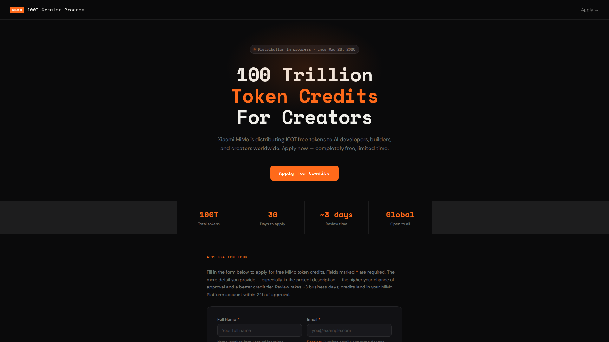
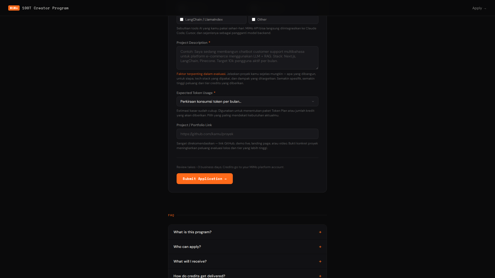

# Xiaomi MiMo 100T Creator Program — Application Page

A clean, dark-themed landing page + application form for the **Xiaomi MiMo 100T Creator Incentive Program** — a limited-time event distributing 100 Trillion free tokens to AI developers and creators worldwide.

🔗 **Live Demo:** https://supernawa.github.io/xiaomi-mimo-builder/

## Screenshots


*Hero section with event details and stats*


*Application form with validation*

---

## What is this?

This project is an unofficial application helper that wraps the [official event](http://100t.xiaomimimo.com/) into a simple, standalone HTML page. It includes:

- Hero section with event summary
- Stats bar (100T tokens, 30-day window, global access)
- Application form with validation
- FAQ accordion
- Toast notification feedback

No build tools, no dependencies — one single `index.html` file.

---

## Event Details

| Detail | Info |
|---|---|
| **Program** | Xiaomi MiMo Orbit 100T Creator Incentive |
| **Period** | April 28 – May 28, 2026 (Beijing Time) |
| **Total Tokens** | 100 Trillion (free, no cost) |
| **Eligibility** | Global — individuals, teams, enterprises |
| **Review Time** | ~3 business days |
| **Delivery** | Within 24h after approval |

---

## Form Fields

| Field | Required | Description |
|---|---|---|
| **Full Name** | ✅ | Your real name for the application |
| **Email** | ✅ | Must match your MiMo Platform account email — credits are sent here |
| **Role** | ✅ | Your profile: indie dev, team, enterprise, researcher, creator |
| **AI Tools Used** | — | Tools you currently use (Claude Code, Cursor, etc.) — improves evaluation |
| **Project Description** | ✅ | Describe your AI project in detail. More specifics = higher approval chance |
| **Expected Token Usage** | ✅ | Monthly volume estimate, used to determine credit tier |
| **Portfolio / Project Link** | — | GitHub, demo, or website — strongly recommended for higher tier |

> **Tip:** The more detailed your project description, the better your evaluation score and credit tier.

---

## Project Structure

```
mimo-100t/
├── index.html       # Complete app — HTML + CSS + JS in one file
└── README.md        # This file
```

---

## Usage

Just open `index.html` in any browser — no server needed.

```bash
# Option 1: Open directly
open index.html

# Option 2: Serve locally
npx serve .
# or
python3 -m http.server 8080
```

---

## Connecting to a Real Backend

The form currently simulates submission with a timeout. To wire it to a real endpoint, replace the `setTimeout` block in `index.html`:

```js
// Replace this block in the submit handler:
setTimeout(() => { ... }, 1400);

// With a real fetch:
const res = await fetch('https://your-api.com/apply', {
  method: 'POST',
  headers: { 'Content-Type': 'application/json' },
  body: JSON.stringify(Object.fromEntries(data))
});
```

---

## Official Links

- 🌐 Event page: [100t.xiaomimimo.com](http://100t.xiaomimimo.com)
- 🔧 API Platform: [platform.xiaomimimo.com](https://platform.xiaomimimo.com)
- 🤖 MiMo Studio: [aistudio.xiaomimimo.com](https://aistudio.xiaomimimo.com)
- 💬 Discord: [discord.gg/7Eh9zx9uh4](https://discord.gg/7Eh9zx9uh4)

---

*This project is not affiliated with or endorsed by Xiaomi. It is a community helper built around the official program.*
